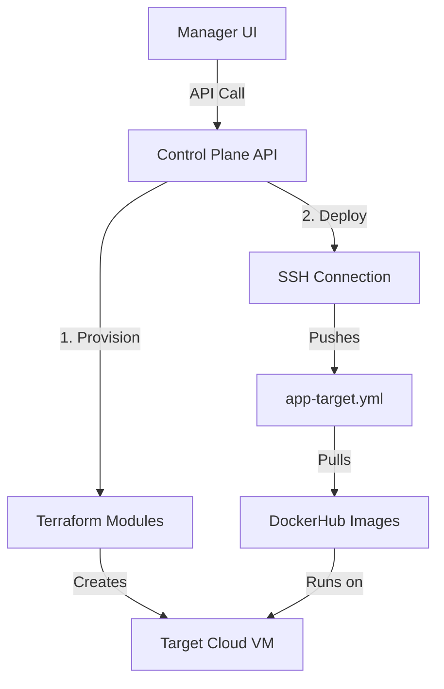

# SparkNode Management Platform — Operations Guide

This document explains the two-stage workflow of the **SparkNode Management UI**.

## Stage 1: Infrastructure Provisioning (Terraform)
*Executed via: `manager-ui` -> `control-plane-api` -> `terraform/modules/`*

1.  **Select Provider:** Choose AWS, Azure, or GCP in the UI.
2.  **Infrastructure Plan:** The `control-plane-api` triggers `terraform plan` using the modules in `deployment_sparknode/terraform/Modules/`.
3.  **Infrastructure Apply:** Upon confirmation, Terraform creates:
    *   Virtual Machine (EC2/Compute Engine)
    *   Virtual Network (VPC/Vnet)
    *   Security Groups (Open ports 80, 443, 22)
    *   S3/Storage Buckets for Database backups
4.  **Result:** The UI stores the `HOST_IP` and `SSH_USER` in the `platform-db`.

## Stage 2: Application Deployment (Target Launch)
*Executed via: `manager-ui` -> `control-plane-api` -> `app-target.yml`*

1.  **Bootstrap VM:** The platform connects via SSH to the newly created VM.
2.  **Install Runtime:** It installs Docker and Docker-Compose if missing.
3.  **Push Blueprint:** It securely copies `deployment_sparknode/docker/app-target.yml` and a generated `.env` file to the target VM.
4.  **Launch Stack:** It executes `docker compose -f app-target.yml up -d` on the remote host.
5.  **Pull Images:** The remote VM pulls the pre-built `sparknode-backend` and `sparknode-frontend` from **DockerHub**.
6.  **Run Migrations:** The platform triggers `alembic upgrade head` inside the remote container.

---

## Technical Flow Overview

